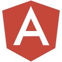

# 👋 Hi, I'm Rawi  
### **Full-Stack Developer | Open-Source Enthusiast**  
<h3 align="center" style>a cat person and an average meme enjoyer !!</h3>

[](https://x.com/RaouiRahmeni)
[](https://www.linkedin.com/in/rawirahmani/)
[](https://elshefra-studios.vercel.app/)

---

### **🚀 My Tech Stack**  
```diff
<p align="left">





<br />
<br />

- 🌱 I’m currently learning AI.
- 👯 I’m looking to collaborate with you 😊
- 🥅 2026 Goals: sell a 1 million dollar app. 📈
<div align="center">
  
  
</div>
